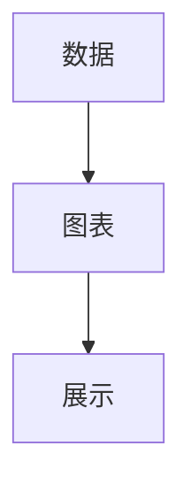

# 代码高亮和代码块

Material for MkDocs提供了强大的代码高亮功能，支持多种编程语言和自定义样式。

## 基本代码块

### 简单代码块

使用三个反引号创建代码块：

```markdown
```
def hello():
    print("Hello, World!")
```
```

### 指定语言

在反引号后指定语言以获得语法高亮：

```markdown
```python
def add(a, b):
    return a + b
```
```

```python
def add(a, b):
    return a + b
```

## 编程语言支持

Material for MkDocs支持所有Pygments支持的语言：

### Python

```python
def fibonacci(n):
    if n <= 1:
        return n
    return fibonacci(n-1) + fibonacci(n-2)
```

### JavaScript

```javascript
function fibonacci(n) {
    if (n <= 1) return n;
    return fibonacci(n-1) + fibonacci(n-2);
}
```

### HTML

```html
<!DOCTYPE html>
<html lang="zh-CN">
<head>
    <meta charset="UTF-8">
    <title>示例页面</title>
</head>
<body>
    <h1>Hello, World!</h1>
</body>
</html>
```

### CSS

```css
body {
    font-family: Arial, sans-serif;
    margin: 0;
    padding: 20px;
}

.container {
    max-width: 800px;
    margin: 0 auto;
}
```

### YAML

```yaml
site_name: My Site
theme:
  name: material
  palette:
    - scheme: default
      primary: 'blue'
      accent: 'blue'
```

### JSON

```json
{
  "name": "My Project",
  "version": "1.0.0",
  "dependencies": {
    "express": "^4.17.1",
    "mongoose": "^6.0.0"
  }
}
```

## 代码块特性

### 行号显示

配置行号显示：

```yaml
markdown_extensions:
  - pymdownx.highlight:
      anchor_linenums: true
      line_spans: __span
      pygments_lang_class: true
```

代码块将显示行号：

```python
def hello():
    print("Hello, World!")
    return True
```

### 代码标注

使用代码标注添加注释：

```markdown
```python
def calculate_sum(numbers):  # (1)
    total = 0                  # (2)
    for num in numbers:        # (3)
        total += num           # (4)
    return total              # (5)
```

1. 函数定义，接收数字列表
2. 初始化总和变量
3. 遍历数字列表
4. 累加每个数字
5. 返回计算结果
```
```

```python
def calculate_sum(numbers):  # (1)
    total = 0                  # (2)
    for num in numbers:        # (3)
        total += num           # (4)
    return total              # (5)
```

### 高亮特定行

```markdown
```python hl_lines="2 4"
def example():
    line1 = "normal"
    line2 = "highlighted"  # 这一行会被高亮
    line3 = "normal"
    line4 = "highlighted"  # 这一行也会被高亮
    line5 = "normal"
```
```

```python hl_lines="2 4"
def example():
    line1 = "normal"
    line2 = "highlighted"  # 这一行会被高亮
    line3 = "normal"
    line4 = "highlighted"  # 这一行也会被高亮
    line5 = "normal"
```

### 代码标题

```markdown
```python title="示例代码"
def hello():
    print("Hello, World!")
```
```

```python title="示例代码"
def hello():
    print("Hello, World!")
```

### 代码复制按钮

启用复制按钮功能：

```yaml
theme:
  features:
    - content.code.copy
```

## 高级代码功能

### 内联代码高亮

```markdown
Python中的 `def` 关键字用于定义函数，`return` 关键字用于返回值。

在JavaScript中，`function` 关键字定义函数，`return` 语句返回值。
```

### 代码组

```markdown
=== "Python"

    ```python
    def greet(name):
        return f"Hello, {name}!"
    ```

=== "JavaScript"

    ```javascript
    function greet(name) {
        return `Hello, ${name}!`;
    }
    ```

=== "Java"

    ```java
    public String greet(String name) {
        return "Hello, " + name + "!";
    }
    ```
```

=== "Python"

    ```python
    def greet(name):
        return f"Hello, {name}!"
    ```

=== "JavaScript"

    ```javascript
    function greet(name) {
        return `Hello, ${name}!`;
    }
    ```

=== "Java"

    ```java
    public String greet(String name) {
        return "Hello, " + name + "!";
    }
    ```

### 代码差异比较

```markdown
```diff
def example():
-    old_code = "removed"
+    new_code = "added"
     unchanged = "same"
```
```

```diff
def example():
-    old_code = "removed"
+    new_code = "added"
     unchanged = "same"
```

## 代码块样式

### 主题样式

```yaml
markdown_extensions:
  - pymdownx.highlight:
      style: github           # 或 monokai, dracula, etc.
      theme: default          # 或 dark, light
      linenums_style: table   # 或 inline
```

### 自定义样式

```css
/* docs/assets/css/custom.css */
:root {
  --md-code-background-color: #f6f8fa;
  --md-code-text-color: #24292e;
  --md-code-font-size: 14px;
  --md-code-line-height: 1.5;
}
```

## 代码块最佳实践

### 1. 选择合适的语言标识符

使用正确的语言标识符确保准确的语法高亮：

```markdown
- Python: python, py
- JavaScript: javascript, js
- HTML: html
- CSS: css
- SQL: sql
- Bash: bash, sh
- PowerShell: powershell, pwsh
```

### 2. 保持代码简洁

```markdown
```python
# ✅ 好的做法 - 简洁明了的代码示例
def calculate_total(items):
    return sum(item.price for item in items)

# ❌ 不好的做法 - 过于复杂的示例
def calculate_total(items, discount=0, tax_rate=0.1, shipping=5, min_order=10):
    # 复杂的业务逻辑...
    subtotal = sum(item.price * item.quantity for item in items)
    discounted = subtotal * (1 - discount)
    taxed = discounted * (1 + tax_rate)
    final_total = taxed + (shipping if subtotal < min_order else 0)
    return round(final_total, 2)
```
```

### 3. 添加代码说明

```markdown
```python
# 计算列表中所有数字的总和
def sum_numbers(numbers):
    total = 0
    for num in numbers:
        total += num
    return total

# 使用示例
result = sum_numbers([1, 2, 3, 4, 5])
print(result)  # 输出: 15
```
```

### 4. 处理敏感信息

```markdown
```python
# 使用环境变量存储敏感信息
import os

API_KEY = os.getenv('API_KEY')
DATABASE_URL = os.getenv('DATABASE_URL')

# ❌ 永远不要硬编码敏感信息
# API_KEY = "sk-1234567890abcdef"  # 不安全！
```
```

## 代码块集成

### 与图表集成

```markdown
```python
# 生成图表数据
import matplotlib.pyplot as plt

data = [1, 2, 3, 4, 5]
plt.plot(data)
plt.show()
```


```

### 与API文档集成

```markdown
```python
import requests

response = requests.get('https://api.example.com/data')
data = response.json()
```

```json
{
  "status": "success",
  "data": {
    "id": 1,
    "name": "Example"
  }
}
```
```

---

**下一步**: [图表和图示](diagrams.md)