# 图表和图示功能

MkDocs Material通过Mermaid.js支持创建专业的图表和图示，让文档更加直观易懂。

## ✨ 核心功能

### 1. 流程图
创建清晰的工作流程和数据流程图

### 2. 序列图
展示系统间的交互流程和调用关系

### 3. 甘特图
项目计划和进度管理的可视化

### 4. 其他图表
支持类图、状态图、饼图等多种图表类型

---

## 🚀 快速开始

### Mermaid配置

在`mkdocs.yml`中启用Mermaid支持：

```yaml
markdown_extensions:
  - pymdownx.superfences:
      custom_fences:
        - name: mermaid
          class: mermaid
          format: !!python/name:pymdownx.superfences.fence_code_format

plugins:
  - mermaid:
      version: 10.6.1
      startOnLoad: true
      theme: default
```

---

## 📊 流程图

### 基本流程图

展示工作流程或数据处理流程：

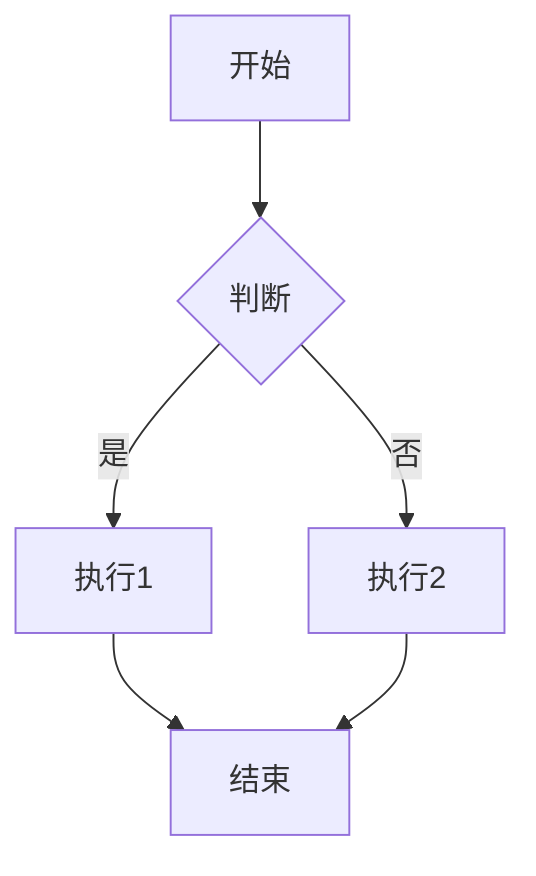

### 横向流程图

适合展示线性流程：

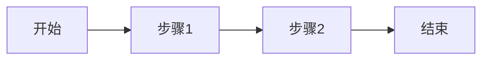

### 复杂流程图

展示包含条件判断的完整流程：

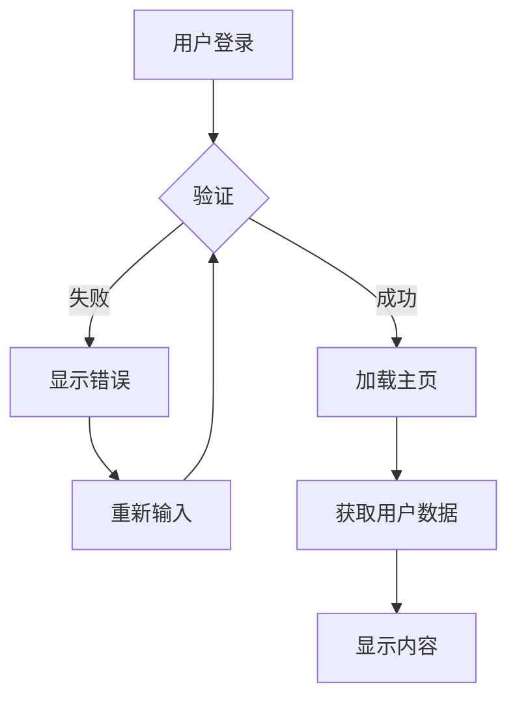

---

## 🔄 序列图

### 基本序列图

展示系统间的交互流程：

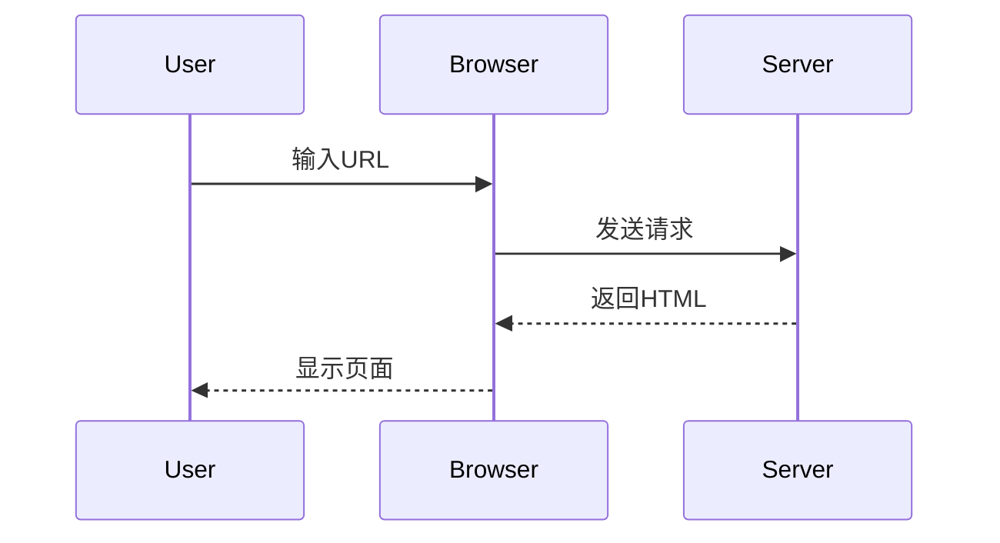

### 复杂序列图

展示包含条件判断的业务流程：

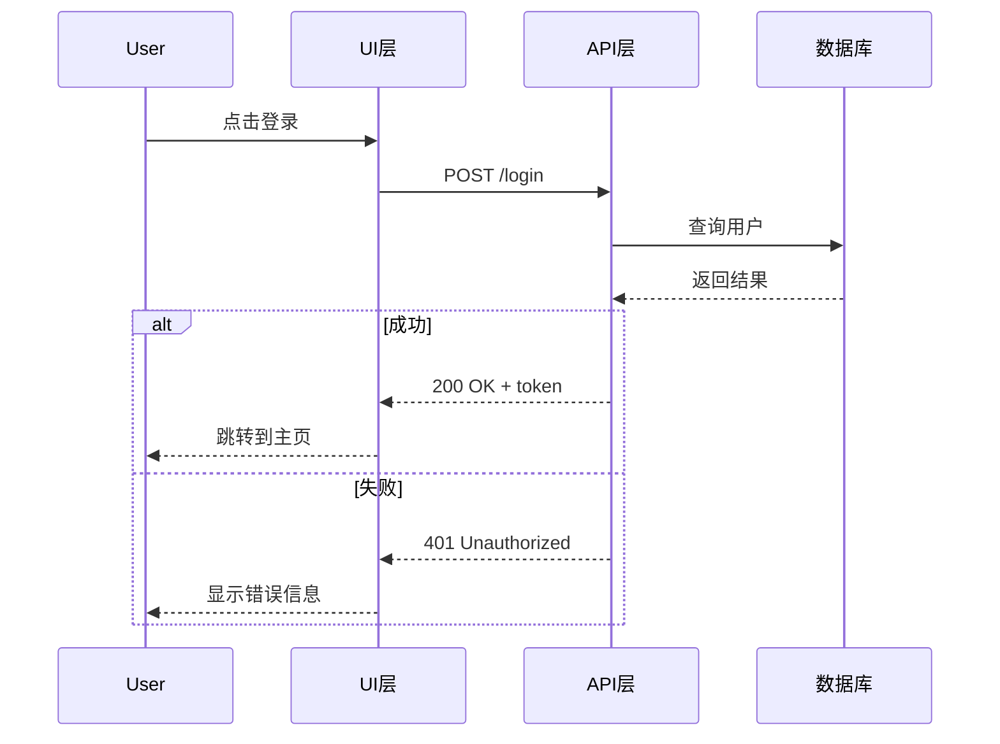

---

## 📅 甘特图

### 项目计划

展示项目的时间安排和任务依赖：

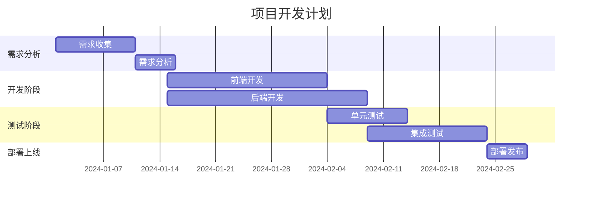

### 里程碑计划

展示项目关键节点和时间安排：

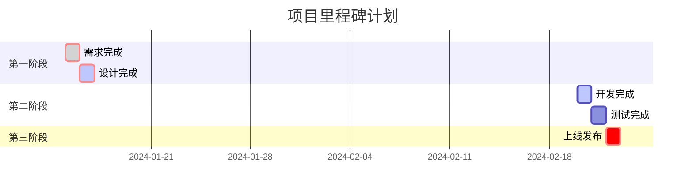

---

## 🎯 饼图

### 数据分布

展示数据的占比情况：

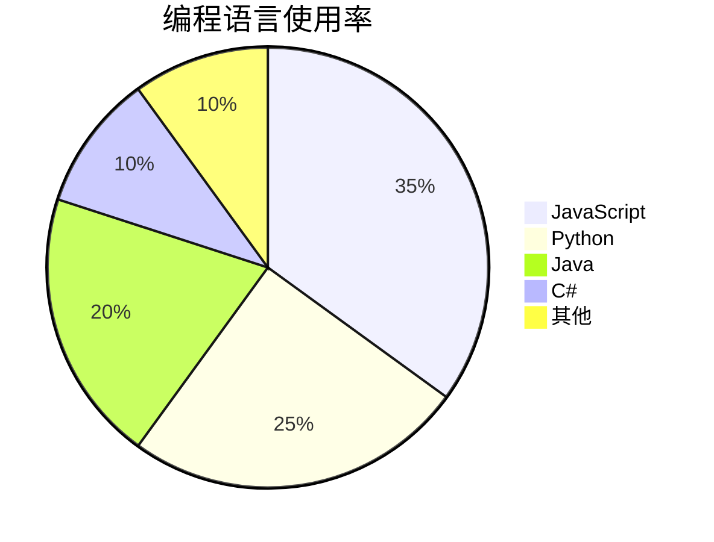

---

## 🏗️ 类图

### 面向对象设计

展示类之间的关系：

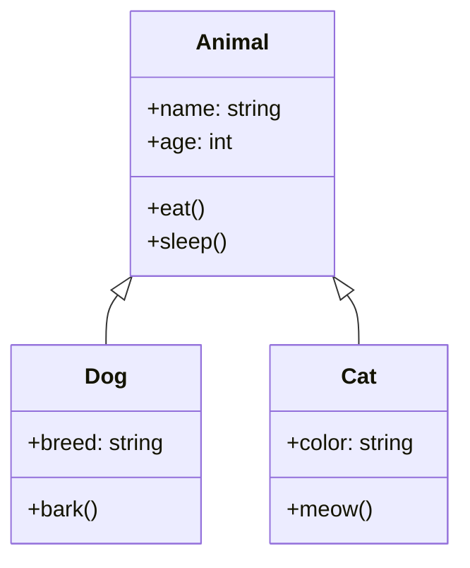

---

## 🔄 状态图

### 状态转换

展示对象的状态变化：

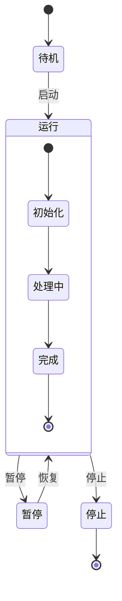

---

## 🎨 图表样式

### 自定义样式

创建自定义CSS文件：

```css
/* docs/assets/css/custom.css */
.mermaid {
    background-color: #f8f9fa;
    border: 1px solid #dee2e6;
    border-radius: 8px;
    padding: 1rem;
    margin: 1rem 0;
}

.mermaid .node rect,
.mermaid .node circle,
.mermaid .node ellipse {
    fill: #e3f2fd !important;
    stroke: #1976d2 !important;
}

.mermaid .edgePath path {
    stroke: #424242 !important;
}
```

### 响应式设计

移动端适配：

```css
@media (max-width: 768px) {
    .mermaid {
        font-size: 12px;
        overflow-x: auto;
    }
}
```

---

## 💡 使用技巧

### 1. 保持简洁

**✅ 推荐：**
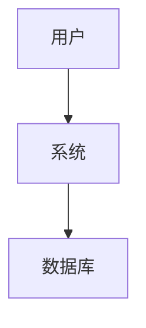

**❌ 不推荐：**
过于复杂的图表，难以理解

### 2. 使用合适的布局

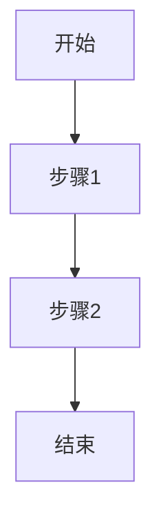

根据内容选择合适的布局：TD（从上到下）、LR（从左到右）

### 3. 添加描述

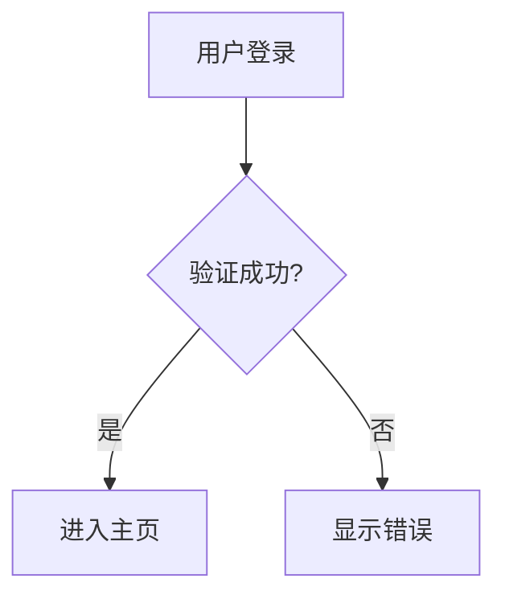

图1：用户登录流程图

---

## 📋 实际应用场景

### 1. 系统设计文档

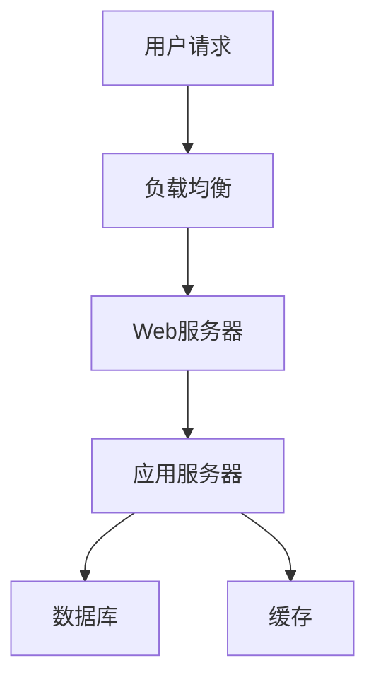

### 2. API文档

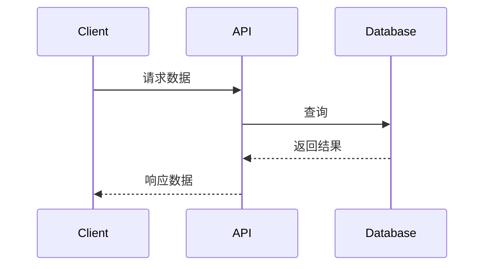

### 3. 项目计划

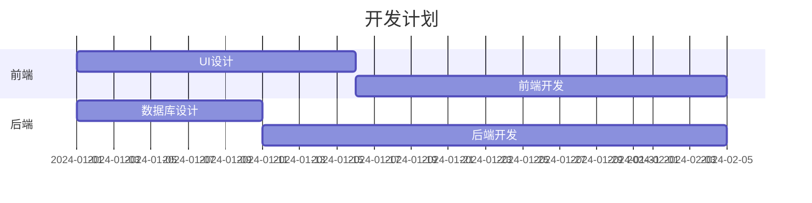

---

## 🎯 教学建议

1. **循序渐进**：从简单流程图开始，逐步介绍复杂图表
2. **结合实际**：使用实际项目中的图表案例
3. **动手实践**：让学生创建自己的图表
4. **对比学习**：比较不同图表类型的适用场景

---

**图表功能让复杂信息变得更加直观易懂！** 📊

**下一步**: [GitHub Pages部署](deployment/github-pages.md)