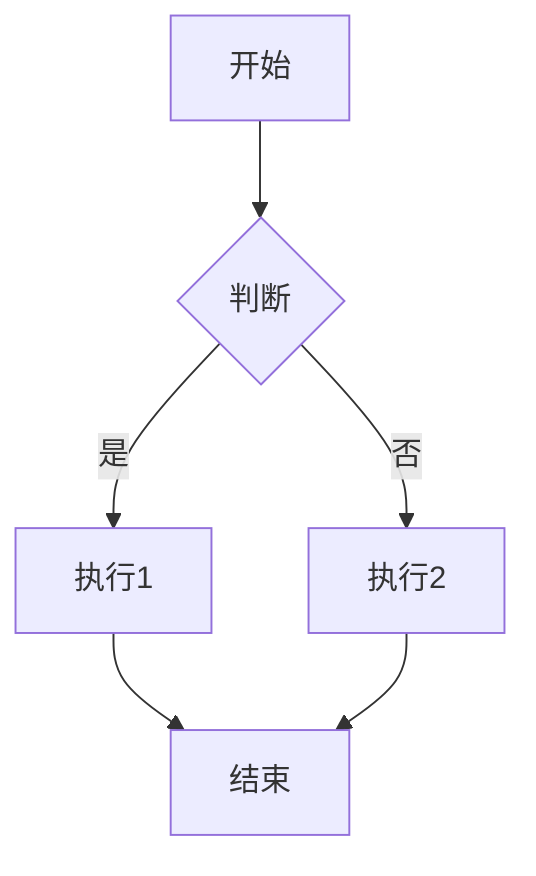
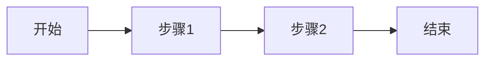
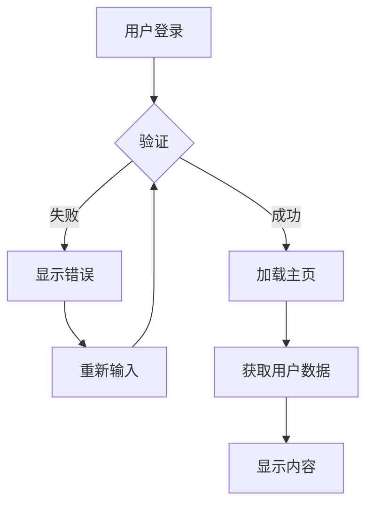
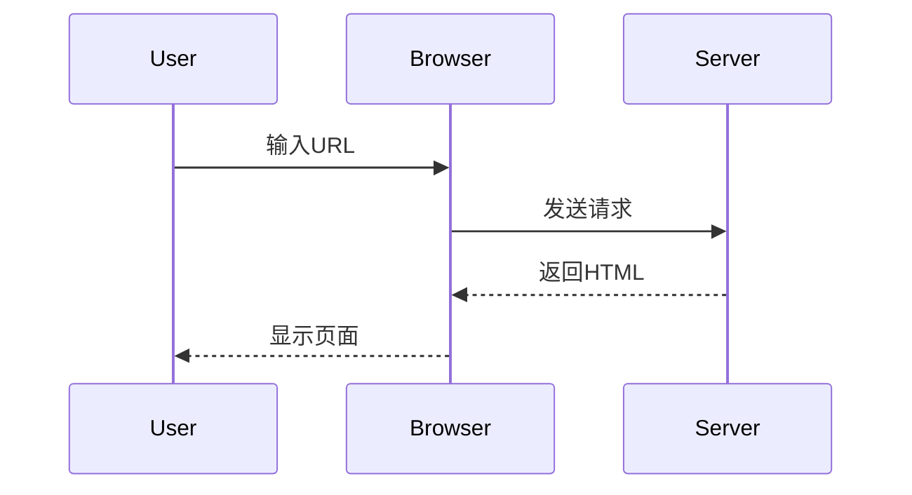
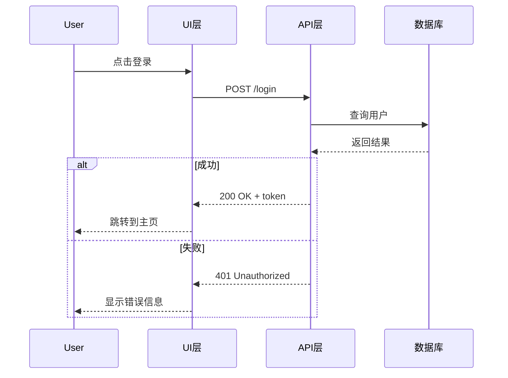
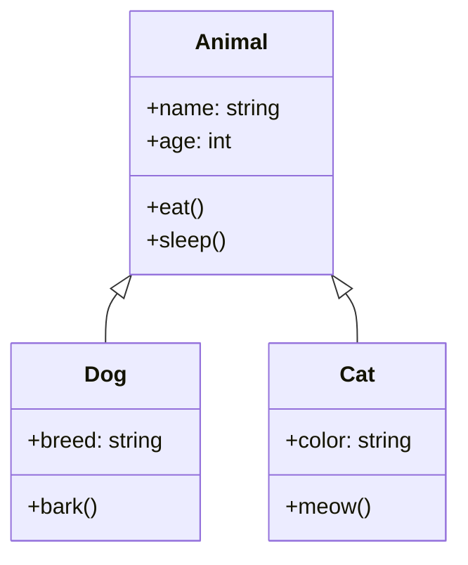
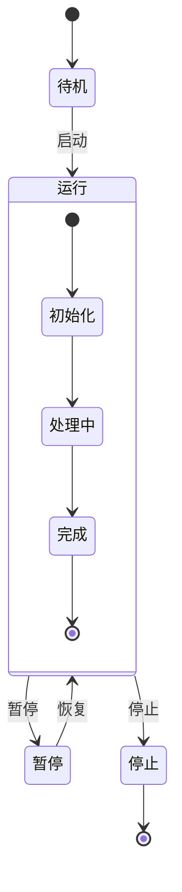
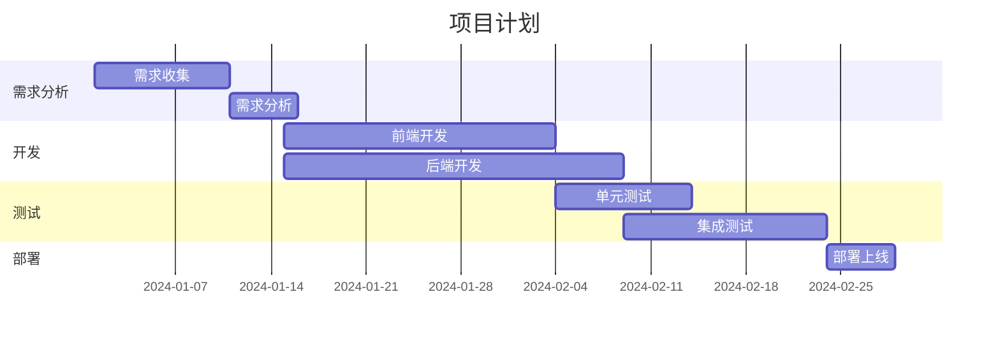
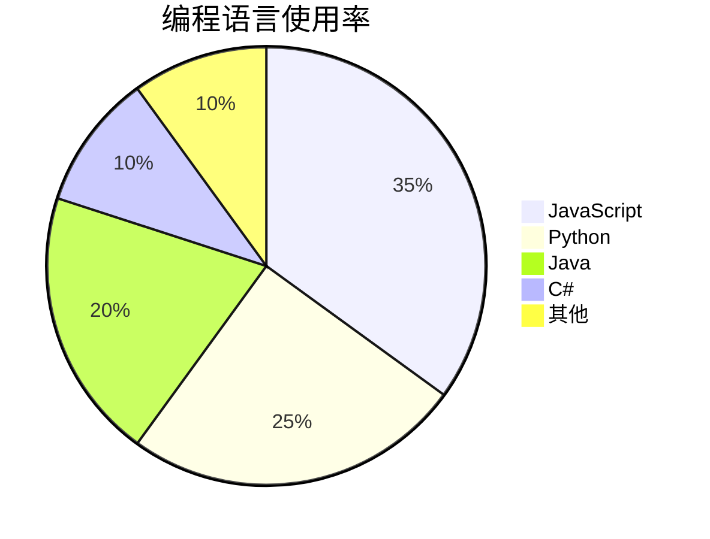
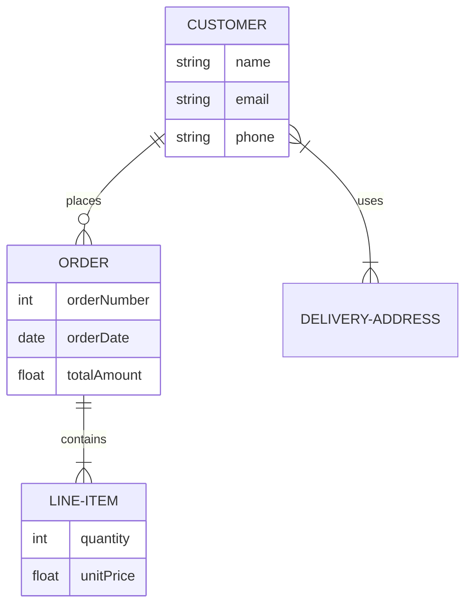

# 图表和图示

Material for MkDocs通过Mermaid.js支持创建复杂的图表和图示。

## Mermaid配置

### 基本配置

```yaml
markdown_extensions:
  - pymdownx.superfences:
      custom_fences:
        - name: mermaid
          class: mermaid
          format: !!python/name:pymdownx.superfences.fence_code_format

plugins:
  - mermaid:
      version: 10.6.1
      startOnLoad: true
      theme: default
      securityLevel: loose
```

### 高级配置

```yaml
plugins:
  - mermaid:
      flowchart:
        useMaxWidth: true
        htmlLabels: true
        curve: basis
      sequence:
        diagramMarginX: 50
        diagramMarginY: 50
        actorMargin: 50
        width: 150
        height: 65
      gantt:
        titleTopMargin: 25
        barHeight: 20
```

## 流程图

### 基本流程图

```markdown

```


### 横向流程图

```markdown

```


### 复杂流程图

```markdown

```


## 序列图

### 基本序列图

```markdown

```


### 复杂序列图

```markdown

```


## 类图

### 基本类图

```markdown

```


## 状态图

### 状态转换图

```markdown

```


## 甘特图

### 项目计划

```markdown

```


### 里程碑

```markdown
```mermaid
gantt
    title 里程碑计划
    dateFormat  YYYY-MM-DD
    milestone 里程碑1
    section 阶段1
    任务1 :crit, done, a1, 2024-01-01, 10d
    任务2 :crit, active, a2, after a1, 15d
    milestone 里程碑2
    section 阶段2
    任务3 :b1, after a2, 20d
    任务4 :b2, after b1, 10d
```
```

## 饼图

### 数据分布

```markdown

```


## 实体关系图

### 数据库设计

```markdown

```

## 图表样式

### 自定义样式

```css
/* docs/assets/css/custom.css */
.mermaid {
    background-color: #f8f9fa;
    border: 1px solid #dee2e6;
    border-radius: 8px;
    padding: 1rem;
    margin: 1rem 0;
}

.mermaid .node rect,
.mermaid .node circle,
.mermaid .node ellipse {
    fill: #e3f2fd !important;
    stroke: #1976d2 !important;
}

.mermaid .edgePath path {
    stroke: #424242 !important;
}
```

### 响应式设计

```css
/* 移动端适配 */
@media (max-width: 768px) {
    .mermaid {
        font-size: 12px;
        overflow-x: auto;
    }
}
```

## 图表最佳实践

### 1. 保持简洁

```markdown
```mermaid
graph TD
    A[用户] --> B[系统]
    B --> C[数据库]
```

<!-- 避免过于复杂的图表 -->
```

### 2. 使用合适的布局

```markdown
```mermaid
graph TD
    A[开始] --> B[步骤1]
    B --> C[步骤2]
    C --> D[结束]
```

<!-- 根据内容选择合适的布局：TD, LR, BT, RL -->
```

### 3. 添加描述

```markdown
```mermaid
graph TD
    A[用户登录] --> B{验证成功?}
    B -->|是| C[进入主页]
    B -->|否| D[显示错误]
```

图1：用户登录流程图
```

### 4. 颜色和样式

```markdown
```mermaid
graph TD
    A[开始] --> B[处理]
    B --> C[结束]

    classDef startEnd fill:#d4edda,stroke:#155724;
    classDef process fill:#fff3cd,stroke:#856404;

    class A,C startEnd;
    class B process;
```
```

## 图表集成

### 与代码结合

```markdown
```python
# 生成Mermaid图表的Python代码
def generate_flowchart():
    return """
    graph TD
        A[开始] --> B[处理]
        B --> C[结束]
    """
```

```mermaid
graph TD
    A[开始] --> B[处理]
    B --> C[结束]
```
```

### 与API文档结合

```markdown
```mermaid
sequenceDiagram
    participant Client
    participant API
    participant Database

    Client->>API: 请求数据
    API->>Database: 查询
    Database-->>API: 返回结果
    API-->>Client: 响应数据
```

**API端点**: `GET /api/data`
**请求参数**: `id`, `type`
**响应格式**: JSON
```

---

**下一步**: [GitHub Pages部署](deployment/github-pages.md)