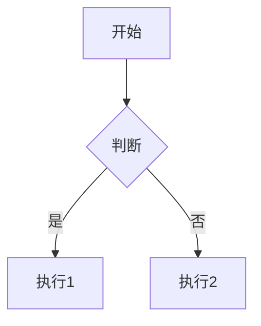

# Markdown扩展功能

MkDocs Material提供了丰富的Markdown扩展，让文档写作更加高效和美观。

## 🚀 内容标签

### 提示框

!!! note "提示"

    这是一个提示框，用于展示重要信息。

### 警告框

!!! warning "警告"

    这是一个警告框，用于提醒注意事项。

### 错误框

!!! error "错误"

    这是一个错误框，用于显示错误信息。

### 成功框

!!! success "成功"

    这是一个成功框，用于展示成功消息。

---

## 📝 任务列表

- [x] 已完成任务
- [ ] 未完成任务

---

## 📊 表格

| 姓名 | 年龄 | 城市 |
|------|------|------|
| 张三 | 25   | 北京 |
| 李四 | 30   | 上海 |

---

## ✨ 特殊格式

### 删除线

~~已删除的文本~~

### 高亮文本

==高亮文本==

---

## 😊 表情符号

:smile: :heart: :rocket: :star:

---

## 📊 图表

---

## 📐 数学公式

$$
\cos x=\sum_{k=0}^{\infty}\frac{(-1)^k}{(2k)!}x^{2k}
$$

---

**下一步**: [代码展示](code.md)