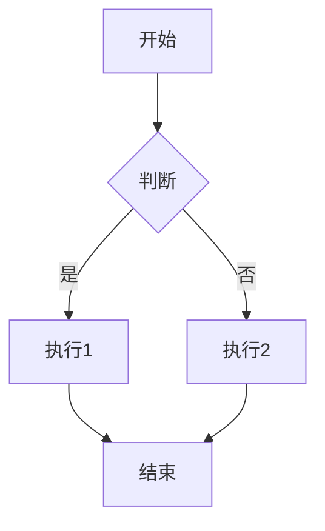
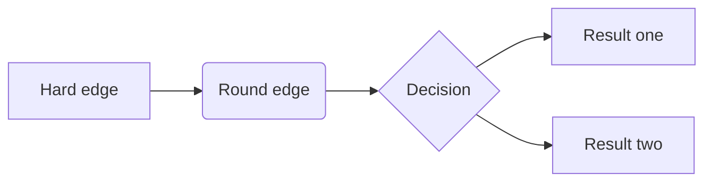
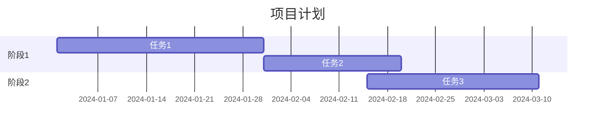

# Markdown扩展

Material for MkDocs提供了丰富的Markdown扩展，让文档写作更加高效和美观。

## 基础扩展

### 属性列表

使用属性列表可以为元素添加额外的属性：

```markdown
[链接文本](url){: .class #id style="color: red" }
```

**效果：**
[链接文本](https://example.com){: .class #id style="color: red" }

### 定义列表

创建术语定义列表：

```markdown
术语1
:   定义1的第一段

    定义1的第二段

术语2
:   定义2
```

**效果：**
术语1
:   定义1的第一段

    定义1的第二段

术语2
:   定义2

### 脚注

添加脚注引用：

```markdown
这是一个句子[^1]。

[^1]: 这是脚注的内容。
```

**效果：**
这是一个句子[^1]。

### 元数据

页面级元数据：

```markdown
---
title: 页面标题
author: 作者名
date: 2024-01-01
description: 页面描述
---

# 页面标题

页面内容...
```

## 高级扩展

### 内容标签

#### 提示框

```markdown
!!! note "提示"
    这是一个提示框。
```

!!! note "提示"
    这是一个提示框。

#### 警告框

```markdown
!!! warning "警告"
    这是一个警告框。
```

!!! warning "警告"
    这是一个警告框。

#### 错误框

```markdown
!!! error "错误"
    这是一个错误框。
```

!!! error "错误"
    这是一个错误框。

#### 成功框

```markdown
!!! success "成功"
    这是一个成功框。
```

!!! success "成功"
    这是一个成功框。

### 嵌套提示框

```markdown
!!! info "外层提示"
    外层内容

    !!! warning "内层警告"
        内层内容

    继续外层内容
```

### 可折叠内容

```markdown
??? "点击展开"

    这是可折叠的内容。
```

??? "点击展开"

    这是可折叠的内容。

### 进度条

```markdown
[进度条](){: .progress }

[== 50%](){: .progress }
```

### 任务列表

```markdown
- [x] 已完成任务
- [ ] 未完成任务
- [x] [链接任务](url)
```

- [x] 已完成任务
- [ ] 未完成任务
- [x] [链接任务](url)

## 代码相关扩展

### 代码高亮

```markdown
```python
def hello():
    print("Hello, World!")
```
```

```python
def hello():
    print("Hello, World!")
```

### 代码标注

```markdown
```python
def add(a, b):  # (1)
    return a + b

result = add(1, 2)  # (2)
```

1. 函数定义
2. 函数调用
```

```python
def add(a, b):  # (1)
    return a + b

result = add(1, 2)  # (2)
```

### 代码复制按钮

```yaml
theme:
  features:
    - content.code.copy
```

### 行号显示

```yaml
markdown_extensions:
  - pymdownx.highlight:
      anchor_linenums: true
      line_spans: __span
      pygments_lang_class: true
```

## 数学公式

### LaTeX数学公式

```markdown
行内公式：$E = mc^2$

块级公式：

$$
E = mc^2
$$

$$
\begin{align*}
x &= a + b \\
y &= c + d
\end{align*}
$$
```

### 数学扩展配置

```yaml
markdown_extensions:
  - pymdownx.arithmatex:
      generic: true
```

## 图表支持

### Mermaid图表

```markdown

```


### 流程图

```markdown

```

### 甘特图

```markdown

```

## 媒体和嵌入

### 视频嵌入

```markdown
<video width="640" height="360" controls>
  <source src="video.mp4" type="video/mp4">
  Your browser does not support the video tag.
</video>
```

### YouTube嵌入

```markdown
<div class="video-container">
  <iframe width="560" height="315"
          src="https://www.youtube.com/embed/dQw4w9WgXcQ"
          frameborder="0" allowfullscreen></iframe>
</div>
```

### 图片优化

```markdown
{: .shadow .rounded }

{: width="400" height="300" loading="lazy" }
```

## 表格增强

### 数据表格

```markdown
| 姓名 | 年龄 | 城市 |
|------|------|------|
| 张三 | 25   | 北京 |
| 李四 | 30   | 上海 |
| 王五 | 28   | 广州 |
```

### 带格式的表格

```markdown
| **姓名** | **年龄** | **城市** |
|----------|----------|----------|
| 张三     | *25*     | 北京     |
| 李四     | **30**   | 上海     |
```

## 链接增强

### 魔术链接

自动链接转换：

```markdown
- @username - 链接到GitHub用户
- #123 - 链接到GitHub issue
- commit:abc123 - 链接到commit
```

### 链接预览

```yaml
markdown_extensions:
  - pymdownx.magiclink:
      repo_url_shortener: true
      provider: github
```

## 目录和标题

### 智能目录

```yaml
markdown_extensions:
  - toc:
      permalink: true
      title: '目录'
      toc_depth: 3
```

### 标题锚点

```markdown
# 标题 { #custom-id }

# 另一个标题

[链接到标题](#custom-id)
```

## 特殊字符和符号

### 表情符号

```markdown
:smile: :heart: :rocket: :star: :fire: :thumbsup:
```

### 特殊符号

```markdown
- 版权符号: (c) 或 &copy;
- 注册符号: (r) 或 &reg;
- 商标符号: (tm) 或 &trade;
- 破折号: -- (en dash), --- (em dash)
- 省略号: ...
```

### 上标和下标

```markdown
上标: x^2^ + y^2^ = z^2^

下标: H~2~O
```

## 引用和引用

### 引用块

```markdown
> 这是一个引用块。
>
> 引用块可以包含多个段落。

> **注意**: 引用块中可以包含其他Markdown元素。
```

> 这是一个引用块。
>
> 引用块可以包含多个段落。

### 嵌套引用

```markdown
> 外层引用
>
> > 内层引用
>
> 继续外层引用
```

## 高级文本格式

### 删除线

```markdown
~~已删除的文本~~

~~**加粗的删除文本**~~

~~*斜体的删除文本*~~
```

### 高亮文本

```markdown
==高亮文本==

==**加粗的高亮文本**==

==*斜体的高亮文本*==
```

### 键盘按键

```markdown
++ctrl+c++ 复制

++ctrl+v++ 粘贴

++ctrl+alt+del++ 任务管理器
```

### 下标和上标

```markdown
H~2~O - 水分子

E=mc^2^ - 质能方程
```

## 列表增强

### 有序列表

```markdown
1. 第一项
2. 第二项
3. 第三项

10. 第十项
11. 第十一项
```

### 无序列表

```markdown
- 项目1
- 项目2
- 项目3

* 项目A
* 项目B
```

### 混合列表

```markdown
1. 第一项
   - 子项目1
   - 子项目2
2. 第二项
   * 子项目A
   * 子项目B
```

---

**下一步**: [代码高亮](code.md)